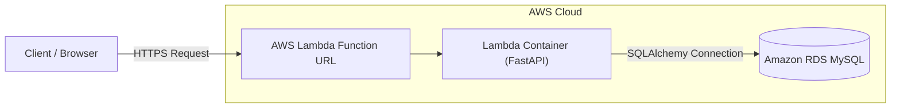
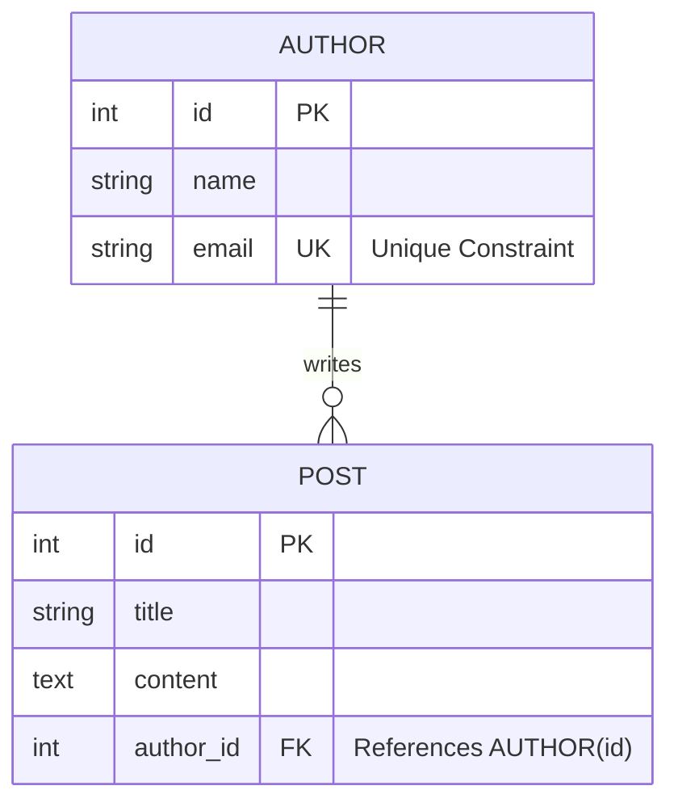

# AWS Cloud-Native Blog API


A production-ready RESTful API designed to demonstrate **Cloud-Native Architecture**, **Serverless Deployment**, and robust **Database Relationship Management**. 

This project goes beyond basic CRUD by implementing strict **One-to-Many relationships**, solving the **N+1 Query Problem**, and deploying via **Docker containers on AWS Lambda**.

---

## Table of Contents
- [Project Overview](#-project-overview)
- [System Architecture](#-system-architecture)
- [Database Schema (ERD)](#-database-schema-erd)
- [Setup: Local Development](#-setup-local-development-for-evaluators)
- [Setup: Cloud Deployment (AWS)](#-setup-cloud-deployment-aws)
- [Systematic Testing Guide](#-systematic-testing-guide-step-by-step)
- [Design Decisions & Optimization](#-design-decisions--optimization)

---

## Project Overview

This API manages a blogging platform where **Authors** can create multiple **Posts**. It is built to satisfy strict backend engineering requirements:
* **Data Integrity:** Enforces Foreign Keys and Cascade Deletes.
* **Performance:** Optimized queries using eager loading strategies.
* **Scalability:** Serverless architecture that scales to zero when idle.

---

## System Architecture

The application is containerized and deployed to **AWS Lambda**, communicating with a managed **Amazon RDS (MySQL)** database.


## Database Schema (ERD)

The database models a strict **one-to-many relationship**.

- **Authors** — Parent entity with a **unique email** constraint  
- **Posts** — Child entity that belongs to exactly one Author  
- **Constraint:** `ON DELETE CASCADE`  
  Deleting an Author automatically deletes all associated Posts

---

### Entity Relationship Diagram (ERD)



## Setup & Installation

### Prerequisites
- Python **3.9+**
- Git
- MySQL Server (Local or Cloud)

---

### 1️. Clone the Repository

```bash
git clone https://github.com/sayyassameer/aws_blog_project.git
cd aws-blog-api
```

### 2️. Virtual Environment

#### Windows
```bash
python -m venv venv
.\venv\Scripts\activate
```

#### Mac/Linux
```bash
python3 -m venv venv
source venv/bin/activate
```

### 3️. Install Dependencies

```bash
pip install -r requirements.txt
```

### 4️. Configuration

Set your database credentials as environment variables.

#### Windows PowerShell
```powershell
$env:DB_HOST="your-rds-endpoint.amazonaws.com"
$env:DB_USER="admin"
$env:DB_PASSWORD="password"
$env:DB_NAME="blog_db"
```

#### Mac/Linux
```bash
export DB_HOST="your-rds-endpoint.amazonaws.com"
export DB_USER="admin"
export DB_PASSWORD="password"
export DB_NAME="blog_db"
```

### 5️. Run the Application

```bash
uvicorn main:app --reload
```
Visit the interactive **Swagger UI** at:  
--> http://127.0.0.1:8000/docs

## ☁️ Setup: Cloud Deployment (AWS)

This project is designed to be deployed as a **Serverless Container** on AWS Lambda.

---

### 1️. Build & Push to AWS ECR

```bash
# Login to AWS ECR
aws ecr get-login-password --region us-east-1 \
| docker login --username AWS --password-stdin YOUR_ACCOUNT_ID.dkr.ecr.us-east-1.amazonaws.com

# Build Docker Image
# --platform linux/amd64 ensures AWS Lambda compatibility
docker build --platform linux/amd64 --provenance=false -t blog-api-repo .

# Tag the Image
docker tag blog-api-repo:latest YOUR_ACCOUNT_ID.dkr.ecr.us-east-1.amazonaws.com/blog-api-repo:latest

# Push the Image to ECR
docker push YOUR_ACCOUNT_ID.dkr.ecr.us-east-1.amazonaws.com/blog-api-repo:latest
```

---

## 2️. AWS Lambda Configuration

- **Create Function:**  
  Select **Container Image** and browse for the pushed ECR image.

- **Architecture:**  
  `x86_64`

- **Network:**  
  Enable public access using **Function URL**  
  **Auth Type:** `NONE`

- **Environment Variables:**  
  Configure the following in the Lambda **Configuration → Environment variables** tab:
  - `DB_HOST`
  - `DB_USER`
  - `DB_PASSWORD`
  - `DB_NAME`

---

### 3️. Run & Verify

Once deployed, AWS will generate a **Lambda Function URL** (for example): `https://xyz.lambda-url.us-east-1.on.aws`


#### Access the API

Open your browser and navigate to: `https://YOUR_FUNCTION_URL/docs`

This will load the interactive **Swagger UI** for verifying the deployed API.

---

## Systematic Testing Guide (Step-by-Step)

To verify full functionality and relationship integrity, execute the following tests **in order** using the Swagger UI: `/docs`

---

### Phase 1: Author Operations

#### 1. Create Author
**Endpoint:** `POST /authors`

**Input:**
```json
{
  "name": "Alice",
  "email": "alice@example.com"
}
```

**Expected Result:**  
`201 Created` with `id: 1`

---

### Get All Authors
**Endpoint:** `GET /authors`

**Expected Result:**  
`200 OK` — JSON list containing **Alice**

---

### Get Single Author
**Endpoint:** `GET /authors/{id}`  
**Input:** `id = 1`

**Expected Result:**  
`200 OK` with Alice’s details

---

### Update Author
**Endpoint:** `PUT /authors/{id}`  
**Input:** `id = 1`

```json
{
  "name": "Alice Updated",
  "email": "alice@example.com"
}
```
**Expected Result:**  
`200 OK` showing the updated name

### Phase 2: Post Operations & Relationships

#### Create Post
**Endpoint:** `POST /posts`

**Input:**
```json
{
  "title": "My First Post",
  "content": "Hello World",
  "author_id": 1
}
```
**Expected Result:**  
`201 Created` with `id: 1`

---

#### Test Relationship Integrity
**Endpoint:** `POST /posts`

**Input:**
```json
{
  "title": "Invalid Post",
  "content": "Fail me",
  "author_id": 999
}
```
**Expected Result:**  
`400 Bad Request`  
(Verifies **foreign key validation**)

---

#### Get All Posts
**Endpoint:** `GET /posts`

**Expected Result:**  
`200 OK` — list containing **"My First Post"**

---

#### Get Single Post with Nested Author
**Endpoint:** `GET /posts/{id}`  
**Input:** `id = 1`

**Expected Result:**  
`200 OK` JSON including the **nested author object**  
(Verifies **eager loading**)

---

#### Get Posts by Author
**Endpoint:** `GET /authors/{id}/posts`  
**Input:** `id = 1`

**Expected Result:**  
`200 OK` list of posts written by **Alice**

---

### Phase 3: Update & Delete (Cleanup)

#### Update Post
**Endpoint:** `PUT /posts/{id}`  
**Input:** `id = 1`

```json
{
  "title": "Updated Title",
  "content": "New Content"
}
```
**Expected Result:**  
`200 OK`

---

#### Delete Post
**Endpoint:** `DELETE /posts/{id}`
**Input:** `id = 1`

**Expected Result:**
`200 OK` — JSON: `{"message": "Post deleted"}`

---

#### Test Cascade Delete
First, create a new post for **Alice** to verify cascade behavior.

**Action:**
Delete the author.

**Endpoint:** `DELETE /authors/{id}`
**Input:** `id = 1`

**Expected Result:**
`200 OK` — JSON: `{"message": "Author and associated posts deleted"}`

**Verification:**  
Call `GET /posts` — the response should be an **empty list**, confirming the post was automatically deleted via `ON DELETE CASCADE`.

## Design Decisions & Optimization

### 1️. Solving the N+1 Query Problem

**Problem:**  
A naive ORM implementation retrieves a list of posts using **1 query**, then executes **N additional queries** (one per author), which severely impacts performance as data grows.

**Solution:**  
Implemented **eager loading** using SQLAlchemy’s `joinedload`, ensuring that posts and their associated authors are fetched in a **single SQL query** via a `JOIN`.

#### Code Snippet (`main.py`)

```python
# Efficiently fetches the Post AND the associated Author in a single query
# Prevents the application from making a separate DB call for the author details
post = (
    db.query(models.Post)
    .options(joinedload(models.Post.author))
    .filter(models.Post.id == id)
    .first()
)
```

### 2️. Modular Code Structure

The codebase is organized to ensure clarity and testability:

- **`models.py`** — Data Layer (SQLAlchemy ORM models & Relationships)
- **`database.py`** — Infrastructure Layer (Connection logic & Environment Config)
- **`main.py`** — Application Layer (FastAPI routes, Pydantic Schemas, and Controllers)
- **`Dockerfile`** — Deployment Layer (Containerization logic)

---

### 3️. Error Handling

The API implements clear and predictable error handling aligned with REST standards:

- **`404 Not Found`**  
  Returned when a requested resource (Author or Post) does not exist.

- **`400 Bad Request`**  
  Triggered when attempting to create a **Post** for a non-existent **Author**, enforcing referential integrity.
